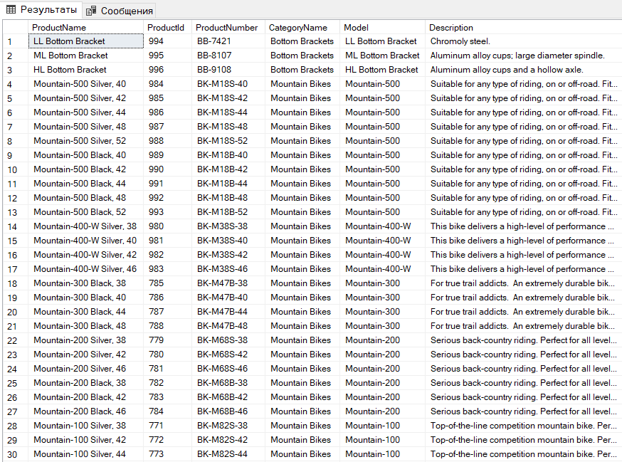
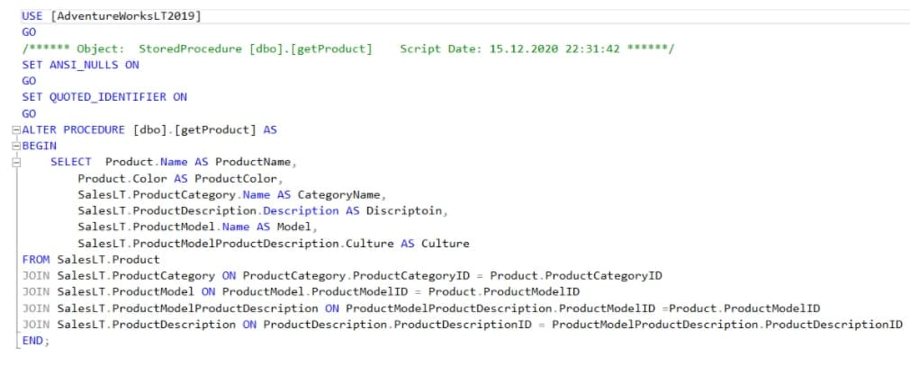
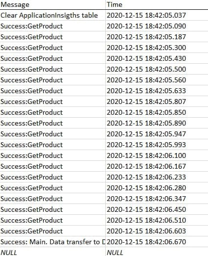
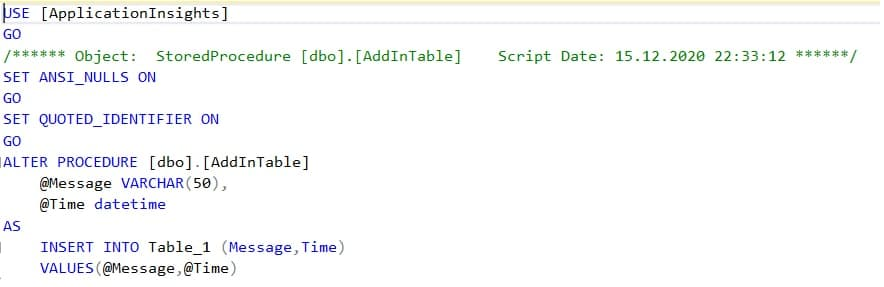
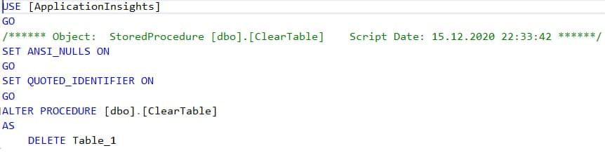

**Лабораторная работа #4. Отчет о проделанной работе**

Моя лаба представляет собой две службы, которые работают одно**moments**но.

1. Служба **FileManager** была разработана в третьей лабы.

2. **DataManager** разрабатывалась в этой ЛР. 
При создании службы была задействована БД **AdventureWorksLT2019**.  

Перейдем к работе программы:

Создание таблицы из шести отношений, на основании данных которых будет хранится xml-файл: 

Разработка необходимых хранимых процедур для работы с таблицами:

Метод **AddInTable** заносит все действия в БД. Таблица выглядит так:

Хранимые процедуры AddInTable, ClearTable:

